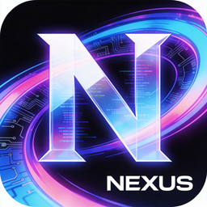

<p align="center">
  
</p>

<h1 align="center">Nexus</h1>

<p align="center">
  <b>Desktop AI Companion</b> · Windows · Live2D · Voice · Memory · Autonomy
</p>

<p align="center">
  <a href="https://github.com/FanyinLiu/Nexus/releases/latest"></a>
  <a href="https://github.com/FanyinLiu/Nexus/actions"></a>
  <a href="https://github.com/FanyinLiu/Nexus/blob/main/LICENSE"></a>
  <a href="https://github.com/FanyinLiu/Nexus/stargazers"></a>
  <a href="https://github.com/FanyinLiu/Nexus"></a>
</p>

<p align="center">
  <a href="#简体中文">简体中文</a> · <a href="#english">English</a>
</p>

---

<!-- Screenshot placeholder — replace with actual screenshot -->
<!-- <p align="center"></p> -->

<a id="简体中文"></a>

## 简体中文

### 目录

- [简介](#简介)
- [核心功能](#核心功能)
- [支持的提供商](#支持的提供商)
- [推荐模型配置](#推荐模型配置)
- [开发机配置参考](#开发机配置参考)
- [快速开始](#快速开始)
- [项目结构](#项目结构)
- [架构概览](#架构概览)
- [技术栈](#技术栈)
- [常用命令](#常用命令)
- [License](#license)

---

### 简介

Nexus 是一个面向 Windows 的桌面 AI 陪伴应用，集成 Live2D 角色渲染、连续语音对话、长期记忆、桌面感知、自主行为与多平台集成能力。支持 18+ LLM 提供商，可完全本地运行或使用云端模型。

---

### 核心功能

| 功能 | 说明 |
|------|------|
| **桌宠 + 面板双视图** | Live2D 角色渲染，表情 / 动作 / 情绪联动 |
| **连续语音对话** | 多引擎 STT / TTS，唤醒词、VAD 语音活动检测、连续对话、语音打断 |
| **长期记忆** | 语义向量检索（BM25 + 向量混合）、每日自动日记、主动召回、记忆衰减与归档 |
| **自主行为** | 内心独白、情绪模型、意图预测、关系追踪、节律学习、技能蒸馏 |
| **桌面感知** | 剪贴板监听、前台窗口识别、截图 OCR、上下文触发器 |
| **工具调用** | 网页搜索（自动正文提取）、天气查询、提醒任务、MCP 协议接入 |
| **多平台集成** | Discord / Telegram 网关、插件系统、技能商店 |
| **多语言** | 简中 / 繁中 / 英 / 日 / 韩界面语言 |

---

### 支持的提供商

<table>
<tr>
<td><b>对话模型 (18+)</b></td>
<td>OpenAI · Anthropic · Google Gemini · xAI Grok · DeepSeek · Moonshot (Kimi) · Qwen (DashScope) · GLM (ZhiPu) · MiniMax · SiliconFlow · OpenRouter · Together AI · Mistral · Qianfan · Z.ai · BytePlus · NVIDIA · Venice · Ollama · Custom OpenAI-compatible</td>
</tr>
<tr>
<td><b>语音输入 (STT)</b></td>
<td>GLM-ASR-Nano · Paraformer · SenseVoice · 智谱 GLM-ASR · 火山引擎 · OpenAI Whisper · Custom OpenAI-compatible</td>
</tr>
<tr>
<td><b>语音输出 (TTS)</b></td>
<td>Edge TTS · CosyVoice · MiniMax · 火山引擎 · DashScope Qwen3-TTS · OmniVoice · OpenAI TTS · Custom OpenAI-compatible</td>
</tr>
<tr>
<td><b>网页搜索</b></td>
<td>DuckDuckGo · Bing · Brave · Tavily · Exa · Firecrawl · Gemini Grounding · Perplexity</td>
</tr>
</table>

---

### 推荐模型配置

#### 对话模型（LLM）

| 场景 | 推荐提供商 | 推荐模型 | 说明 |
|------|-----------|---------|------|
| **日常陪伴（国内首选）** | DeepSeek | `deepseek-chat` | 中文能力强、价格极低，适合长时间陪伴对话 |
| **日常陪伴（国内备选）** | DashScope Qwen | `qwen-plus` | 阿里通义千问，中文自然，长上下文支持好 |
| **深度推理** | DeepSeek | `deepseek-reasoner` | 需要复杂推理、数学、代码时使用 |
| **最强综合** | Anthropic | `claude-sonnet-4-6` | 综合能力最强，工具调用稳定 |
| **高性价比（海外）** | OpenAI | `gpt-5.4-mini` | 速度快、便宜，适合高频对话 |
| **免费体验** | Google Gemini | `gemini-2.5-flash` | 免费额度大，适合入门体验 |
| **本地运行** | Ollama | `qwen3:8b` | RTX 3060 12GB 可流畅运行，完全离线 |
| **本地运行（轻量）** | Ollama | `qwen3:4b` | 4GB VRAM 即可运行，响应更快 |

#### 语音输入（STT）

| 场景 | 推荐提供商 | 说明 |
|------|-----------|------|
| **本地高精度** | GLM-ASR-Nano | 中文识别准确率高，RTX 3060 可流畅运行，完全离线 |
| **本地流式** | Paraformer | 边说边出字，延迟低，适合连续对话 |
| **本地高精度（备选）** | SenseVoice | 多语言支持好，识别精度高 |
| **云端首选** | 智谱 GLM-ASR | 中文最佳，支持热词纠正 |
| **云端备选** | 火山引擎 | 字节跳动大模型语音识别 |

#### 语音输出（TTS）

| 场景 | 推荐提供商 | 推荐音色 | 说明 |
|------|-----------|---------|------|
| **免费首选** | Edge TTS | 晓晓 (`zh-CN-XiaoxiaoNeural`) | 微软免费，音质好，无需 API Key |
| **本地离线** | CosyVoice | SFT 预置音色 | 完全离线，RTX 3060 可运行 |
| **最自然（国内）** | MiniMax | 少女音色 (`female-shaonv`) | 情感表现力强，适合陪伴角色 |
| **最自然（海外）** | ElevenLabs | — | 全球最佳语音合成 |
| **高性价比** | 火山引擎 | 灿灿 (`BV700_streaming`) | 自然度高，价格低 |

#### 网页搜索

| 场景 | 推荐提供商 | 说明 |
|------|-----------|------|
| **免费默认** | DuckDuckGo | 无需 API Key，中文搜索效果好 |
| **高质量** | Tavily | 内置摘要，搜索深度好 |
| **AI 增强** | Gemini Grounding | 通过 Gemini 做搜索落地，自动生成答案 |
| **隐私优先** | Brave Search | 注重隐私，结果质量高 |

---

### 开发机配置参考

以下为作者的开发和测试环境，可作为硬件参考：

| 组件 | 型号 |
|------|------|
| CPU | Intel Core i5-12400F (6C12T) |
| GPU | NVIDIA GeForce RTX 3060 12GB |
| 内存 | 32GB DDR4 |
| 系统 | Windows 11 Pro |

> RTX 3060 12GB 可以流畅运行大部分本地模型（8B 参数以下），包括本地 STT 和 TTS。如果你的显卡 VRAM < 8GB，建议优先使用云端模型。

---

### 快速开始

**环境要求**：Windows 10/11 · Node.js 22+ · npm 10+

```bash
# 1. 克隆仓库
git clone https://github.com/FanyinLiu/Nexus.git
cd Nexus

# 2. 安装依赖
npm install

# 3. 开发模式启动
npm run electron:dev

# 4. 构建生产版本
npm run build

# 5. 打包 Windows 安装程序
npm run package:win
```

---

### 项目结构

```
electron/                桌面运行时与原生桥接
  ipc/                   IPC 通道 (audio / chat / memory / tts / discord / telegram / plugin / skill …)
  services/              后端服务 (TTS · 向量存储 · MCP · 插件宿主 · 密钥保险库 …)
src/
  app/                   应用组装、控制器、视图
    controllers/         useAppController · useAutonomyController
    store/               设置持久化
  components/            共享 UI 组件
    settingsSections/    设置面板各分区
  features/              领域模块
    autonomy/            自主行为 (内心独白 / 情绪 / 目标 / 意图 / 关系 / 节律 / 技能蒸馏)
    hearing/             STT 引擎适配
    memory/              语义记忆 · 向量 + BM25 混合检索 · 聚类 · 衰减 · 归档
    chat/                模型调用运行时 · 上下文压缩
    tools/               工具路由 · 熔断器 · 并行执行 · 权限
    integrations/        外部平台集成 (Discord / Telegram)
    skills/              技能蒸馏与自动生成
    metering/            上下文计量
  hooks/                 React 编排 Hook
    voice/               语音会话启停 · STT · TTS · 连续对话
    chat/                助手回复 · 提醒
  i18n/                  多语言 (zh-CN / zh-TW / en / ja / ko)
  lib/                   纯工具函数与提供者注册表
  types/                 类型定义
tests/                   测试
scripts/                 本地模型启动脚本 (GLM-ASR · OmniVoice)
```

---

### 架构概览

```
                    ┌──────────────────────────────────┐
                    │         Electron Main             │
                    │  IPC · TTS · STT · MCP · Plugins  │
                    │  Discord · Telegram · KeyVault     │
                    └───────────────┬──────────────────┘
                                    │
                    ┌───────────────▼──────────────────┐
                    │         React Frontend            │
                    ├──────────────────────────────────┤
                    │  useAppController                 │
                    │    ├─ useVoice (VoiceBus)         │
                    │    ├─ useChat (runtime)           │
                    │    ├─ useMemory (vector)          │
                    │    └─ useAutonomy (tick engine)   │
                    ├──────────────────────────────────┤
                    │  features/                        │
                    │    ├─ autonomy (monologue/emotion/│
                    │    │   goal/intent/relationship)  │
                    │    ├─ hearing (STT engines)       │
                    │    ├─ memory (vector + BM25)      │
                    │    ├─ chat (LLM runtime)          │
                    │    ├─ tools (search/weather/MCP)  │
                    │    ├─ integrations (Discord/TG)   │
                    │    └─ skills (distillation)       │
                    └──────────────────────────────────┘
```

---

### 技术栈

| 层 | 技术 |
|------|------|
| 运行时 | Electron 36 |
| 前端 | React 19 · TypeScript · Vite 8 |
| 角色 | PixiJS · pixi-live2d-display |
| 语音输入 | Sherpa-onnx · SenseVoice · Paraformer · GLM-ASR-Nano · 智谱 ASR · 火山引擎 |
| 语音输出 | Edge TTS · MiniMax · 火山引擎 · CosyVoice · OmniVoice · DashScope Qwen3-TTS · OpenAI TTS |
| 对话模型 | OpenAI · Anthropic · Gemini · DeepSeek · Kimi · Qwen · GLM · Grok · Ollama 等 18+ |
| 网页搜索 | DuckDuckGo · Bing · Brave · Tavily · Exa · Firecrawl · Gemini Grounding · Perplexity |
| 本地 ML | onnxruntime-web · @huggingface/transformers |
| 打包 | electron-builder |

---

### 常用命令

| 命令 | 说明 |
|------|------|
| `npm run dev` | Vite 开发服务器 |
| `npm run electron:dev` | Electron 联调 |
| `npm run build` | 构建前端 |
| `npm test` | 运行测试 |
| `npm run package:win` | 生成安装包 |

---

<a id="english"></a>

## English

### Table of Contents

- [Overview](#overview)
- [Features](#features)
- [Supported Providers](#supported-providers)
- [Recommended Models](#recommended-models)
- [Hardware Reference](#hardware-reference)
- [Quick Start](#quick-start-1)
- [Project Structure](#project-structure)
- [Architecture](#architecture)
- [Tech Stack](#tech-stack)
- [License](#license)

---

### Overview

Nexus is a Windows desktop AI companion featuring Live2D character rendering, continuous voice conversation, long-term memory, desktop awareness, autonomous behavior, and multi-platform integrations. It supports 18+ LLM providers and can run fully local or with cloud models.

---

### Features

| Feature | Description |
|---------|-------------|
| **Pet + Panel dual-view** | Live2D character with expression, motion, and mood sync |
| **Continuous voice chat** | Multi-engine STT / TTS with wake word, VAD, continuous conversation, speech interruption |
| **Long-term memory** | Hybrid BM25 + vector search, auto daily diary, proactive recall, memory decay and archive |
| **Autonomous behavior** | Inner monologue, emotion model, intent prediction, relationship tracking, rhythm learning, skill distillation |
| **Desktop awareness** | Clipboard, foreground window, screenshot OCR, context triggers |
| **Tool calling** | Web search (auto content extraction), weather, reminders, MCP protocol |
| **Multi-platform** | Discord / Telegram gateways, plugin system, skill store |
| **Multilingual** | Simplified Chinese / Traditional Chinese / English / Japanese / Korean |

---

### Supported Providers

<table>
<tr>
<td><b>LLM (18+)</b></td>
<td>OpenAI · Anthropic · Google Gemini · xAI Grok · DeepSeek · Moonshot (Kimi) · Qwen (DashScope) · GLM (ZhiPu) · MiniMax · SiliconFlow · OpenRouter · Together AI · Mistral · Qianfan · Z.ai · BytePlus · NVIDIA · Venice · Ollama · Custom OpenAI-compatible</td>
</tr>
<tr>
<td><b>STT</b></td>
<td>GLM-ASR-Nano · Paraformer · SenseVoice · Zhipu GLM-ASR · Volcengine · OpenAI Whisper · Custom OpenAI-compatible</td>
</tr>
<tr>
<td><b>TTS</b></td>
<td>Edge TTS · CosyVoice · MiniMax · Volcengine · DashScope Qwen3-TTS · OmniVoice · OpenAI TTS · Custom OpenAI-compatible</td>
</tr>
<tr>
<td><b>Web Search</b></td>
<td>DuckDuckGo · Bing · Brave · Tavily · Exa · Firecrawl · Gemini Grounding · Perplexity</td>
</tr>
</table>

---

### Recommended Models

#### Chat Models (LLM)

| Use Case | Provider | Model | Notes |
|----------|----------|-------|-------|
| **Daily companion (CN)** | DeepSeek | `deepseek-chat` | Strong Chinese, very affordable |
| **Daily companion (alt)** | DashScope Qwen | `qwen-plus` | Long context, natural Chinese |
| **Deep reasoning** | DeepSeek | `deepseek-reasoner` | Complex reasoning / math / code |
| **Best overall** | Anthropic | `claude-sonnet-4-6` | Top capability, reliable tool use |
| **Cost-effective** | OpenAI | `gpt-5.4-mini` | Fast and cheap for high-frequency chat |
| **Free tier** | Google Gemini | `gemini-2.5-flash` | Generous free quota |
| **Local** | Ollama | `qwen3:8b` | Runs smoothly on RTX 3060 12GB, fully offline |
| **Local (lightweight)** | Ollama | `qwen3:4b` | 4GB VRAM, faster response |

#### STT (Speech-to-Text)

| Use Case | Provider | Notes |
|----------|----------|-------|
| **Local high-accuracy** | GLM-ASR-Nano | Best Chinese accuracy, runs on RTX 3060, offline |
| **Local streaming** | Paraformer | Low-latency real-time transcription |
| **Cloud (CN)** | Zhipu GLM-ASR | Top Chinese accuracy with hotword support |

#### TTS (Text-to-Speech)

| Use Case | Provider | Notes |
|----------|----------|-------|
| **Free default** | Edge TTS | Microsoft free voices, no API key needed |
| **Local offline** | CosyVoice | Fully offline on RTX 3060 |
| **Most natural (CN)** | MiniMax | Expressive voices for companion characters |

---

### Hardware Reference

| Component | Model |
|-----------|-------|
| CPU | Intel Core i5-12400F (6C12T) |
| GPU | NVIDIA GeForce RTX 3060 12GB |
| RAM | 32GB DDR4 |
| OS | Windows 11 Pro |

> The RTX 3060 12GB can smoothly run most local models (under 8B parameters), including local STT and TTS. If your GPU has less than 8GB VRAM, cloud-based models are recommended.

---

### Quick Start

**Requirements**: Windows 10/11 · Node.js 22+ · npm 10+

```bash
# 1. Clone the repository
git clone https://github.com/FanyinLiu/Nexus.git
cd Nexus

# 2. Install dependencies
npm install

# 3. Start in development mode
npm run electron:dev

# 4. Build for production
npm run build

# 5. Package Windows installer
npm run package:win
```

---

### Project Structure

```
electron/                Desktop runtime & native bridge
  ipc/                   IPC channels (audio / chat / memory / tts / discord / telegram / plugin / skill …)
  services/              Backend services (TTS · vector store · MCP · plugin host · key vault …)
src/
  app/                   App assembly, controllers, views
  components/            Shared UI components
  features/              Domain modules
    autonomy/            Autonomous behavior (monologue / emotion / goal / intent / relationship / rhythm / skill)
    hearing/             STT engine adapters
    memory/              Semantic memory · vector + BM25 hybrid search · clustering · decay · archive
    chat/                LLM runtime · context compression
    tools/               Tool router · circuit breaker · parallel execution · permissions
    integrations/        External platform integration (Discord / Telegram)
    skills/              Skill distillation & auto-generation
  hooks/                 React orchestration hooks
  i18n/                  Multilingual (zh-CN / zh-TW / en / ja / ko)
  lib/                   Pure utilities & provider registry
  types/                 Type definitions
tests/                   Tests
scripts/                 Local model launch scripts (GLM-ASR · OmniVoice)
```

---

### Architecture

```
                    ┌──────────────────────────────────┐
                    │         Electron Main             │
                    │  IPC · TTS · STT · MCP · Plugins  │
                    │  Discord · Telegram · KeyVault     │
                    └───────────────┬──────────────────┘
                                    │
                    ┌───────────────▼──────────────────┐
                    │         React Frontend            │
                    ├──────────────────────────────────┤
                    │  useAppController                 │
                    │    ├─ useVoice (VoiceBus)         │
                    │    ├─ useChat (runtime)           │
                    │    ├─ useMemory (vector)          │
                    │    └─ useAutonomy (tick engine)   │
                    ├──────────────────────────────────┤
                    │  features/                        │
                    │    ├─ autonomy                    │
                    │    ├─ hearing (STT engines)       │
                    │    ├─ memory (vector + BM25)      │
                    │    ├─ chat (LLM runtime)          │
                    │    ├─ tools (search/weather/MCP)  │
                    │    ├─ integrations (Discord/TG)   │
                    │    └─ skills (distillation)       │
                    └──────────────────────────────────┘
```

---

### Tech Stack

| Layer | Technology |
|-------|-----------|
| Runtime | Electron 36 |
| Frontend | React 19 · TypeScript · Vite 8 |
| Character | PixiJS · pixi-live2d-display |
| STT | Sherpa-onnx · SenseVoice · Paraformer · GLM-ASR-Nano · Zhipu ASR · Volcengine |
| TTS | Edge TTS · MiniMax · Volcengine · CosyVoice · OmniVoice · DashScope Qwen3-TTS · OpenAI TTS |
| LLM | OpenAI · Anthropic · Gemini · DeepSeek · Kimi · Qwen · GLM · Grok · Ollama + 18 more |
| Web Search | DuckDuckGo · Bing · Brave · Tavily · Exa · Firecrawl · Gemini Grounding · Perplexity |
| Local ML | onnxruntime-web · @huggingface/transformers |
| Packaging | electron-builder |

---

## License

[MIT](LICENSE)
