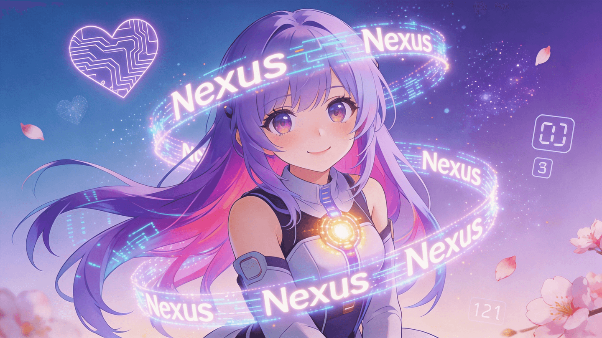

<p align="center"></p>

<h1 align="center">Nexus</h1>

<h3 align="center">一个住在你桌面上的 AI 伙伴——会记忆、会做梦、会陪伴。</h3>

<p align="center">
  <a href="https://github.com/FanyinLiu/Nexus/releases/latest"></a>
  <a href="https://github.com/FanyinLiu/Nexus/blob/main/LICENSE"></a>
  <a href="https://github.com/FanyinLiu/Nexus/stargazers"></a>
  <a href="https://github.com/FanyinLiu/Nexus"></a>
</p>

<p align="center">
  <a href="../README.md">English</a> · <b>简体中文</b> · <a href="README.zh-TW.md">繁體中文</a> · <a href="README.ja.md">日本語</a>
</p>

---

> **注意**：Nexus 正在积极开发中。部分功能已经稳定，部分仍在打磨。欢迎反馈和贡献！

## Nexus 是什么？

Nexus 是一个跨平台的桌面 AI 伙伴，基于大语言模型驱动。它将 Live2D 角色与语音对话、长期记忆、桌面感知、自主行为和工具调用相结合——设计目标不是做一个聊天机器人，而是一个真正了解你的伙伴。

使用 Electron + React + TypeScript 构建，支持 Windows、macOS 和 Linux。内置 18+ LLM 提供商，可完全离线运行或使用云端模型。

<!-- TODO: Add demo screenshots here
### 演示

|  |  |
|:---:|:---:|
| 桌宠模式 | 聊天面板 |
-->

---

## 功能特性

- 🎙️ **常驻唤醒词** — 说出唤醒词即可开始对话，无需按键。基于 sherpa-onnx 关键词检测，主进程 Silero VAD 共享单路麦克风流。

- 🗣️ **连续语音对话** — 多引擎 STT / TTS，回声消除自动打断（说话时不会被自己的声音唤醒），句级流式 TTS（第一个逗号就开始播报）。

- 🧠 **会做梦的记忆** — 热 / 温 / 冷三级记忆架构，BM25 + 向量混合检索。每晚执行*梦境循环*，将对话聚类成*叙事线索*，让伙伴逐渐建立对你的完整认知。

- 🤖 **自主内在生活** — 内心独白、情绪模型、关系追踪、节律学习、意图预测、技能蒸馏。你不在时它会思考，你回来时它会主动问候。

- 🔧 **工具调用 (MCP)** — 网页搜索、天气查询、提醒任务及任何 MCP 兼容工具。支持原生函数调用，同时为不支持 `tools` 的模型提供提示词模式回退。

- 🔄 **提供商故障转移** — 可串联多个 LLM / STT / TTS 提供商。当某个提供商宕机时，Nexus 自动切换到下一个，对话不中断。

- 🖥️ **桌面感知** — 读取剪贴板、前台窗口标题，以及（可选的）屏幕 OCR。上下文触发器让它能对你正在做的事情作出反应。

- 🔔 **通知桥接** — 本地 Webhook 服务器 + RSS 轮询。将外部通知推送到伙伴的对话中。

- 💬 **多平台** — Discord 和 Telegram 网关，支持按聊天路由。在手机上也能和伙伴对话。

- 🌐 **多语言** — 界面支持简体中文、繁体中文、英语、日语和韩语。

---

## 支持的提供商

| 类别 | 提供商 |
|------|--------|
| **LLM (18+)** | OpenAI · Anthropic · Gemini · DeepSeek · Kimi · Qwen · GLM · Grok · MiniMax · SiliconFlow · OpenRouter · Together · Mistral · Qianfan · Z.ai · BytePlus · NVIDIA · Venice · Ollama · Custom |
| **STT** | GLM-ASR-Nano · Paraformer · SenseVoice · Zhipu GLM-ASR · Volcengine · OpenAI Whisper · ElevenLabs Scribe · Tencent ASR · Custom |
| **TTS** | Edge TTS · MiniMax · Volcengine · DashScope Qwen3-TTS · OmniVoice · OpenAI TTS · ElevenLabs · Custom |
| **网页搜索** | DuckDuckGo · Bing · Brave · Tavily · Exa · Firecrawl · Gemini Grounding · Perplexity |

---

## 推荐模型配置

> 此推荐针对**简体中文用户**。其他语言请查看 [English](../README.md) · [繁體中文](README.zh-TW.md) · [日本語](README.ja.md)。

### 对话模型（LLM）

| 场景 | 推荐提供商 | 推荐模型 | 说明 |
|------|-----------|---------|------|
| **日常陪伴（首选）** | DeepSeek | `deepseek-chat` | 中文能力强、价格极低，适合长时间陪伴对话 |
| **日常陪伴（备选）** | DashScope Qwen | `qwen-plus` | 阿里通义千问，中文自然，长上下文支持好 |
| **深度推理** | DeepSeek | `deepseek-reasoner` | 需要复杂推理、数学、代码时使用 |
| **最强综合** | Anthropic | `claude-sonnet-4-6` | 综合能力最强，工具调用稳定 |
| **高性价比（海外）** | OpenAI | `gpt-5.4-mini` | 速度快、便宜，适合高频对话 |
| **免费体验** | Google Gemini | `gemini-2.5-flash` | 免费额度大，适合入门体验 |

### 语音输入（STT）

| 场景 | 推荐提供商 | 推荐模型 | 说明 |
|------|-----------|---------|------|
| **本地高精度** | GLM-ASR-Nano | `glm-asr-nano` | 中文识别准确率高，RTX 3060 可流畅运行，完全离线 |
| **本地流式** | Paraformer | `paraformer-trilingual` | 边说边出字，延迟低，中英粤三语，适合连续对话 |
| **本地备选** | SenseVoice | `sensevoice-zh-en` | 比 Whisper 快 15 倍，中英双语离线识别 |
| **云端首选** | 智谱 GLM-ASR | `glm-asr-2512` | 中文最佳，支持热词纠正 |
| **云端备选** | 火山引擎 | `bigmodel` | 字节跳动大模型语音识别，中文优秀 |
| **云端备选** | 腾讯云 ASR | `16k_zh` | 实时流式识别，延迟低 |

### 语音输出（TTS）

| 场景 | 推荐提供商 | 推荐音色 | 说明 |
|------|-----------|---------|------|
| **免费首选** | Edge TTS | 晓晓 (`zh-CN-XiaoxiaoNeural`) | 微软免费，音质好，无需 API Key |
| **本地离线** | OmniVoice | 内置音色 | 完全离线，本地端口 8000，RTX 3060 可运行 |
| **最自然** | MiniMax | 少女音色 (`female-shaonv`) | 情感表现力强，适合陪伴角色 |
| **中文指令化** | DashScope Qwen-TTS | `Cherry` | 阿里 Qwen3-TTS，支持方言和指令化播报 |
| **高性价比** | 火山引擎 | 灿灿 (`BV700_streaming`) | 自然度高，价格低 |

---

## 快速开始

**前置要求**：Node.js 22+ · npm 10+

```bash
git clone https://github.com/FanyinLiu/Nexus.git
cd Nexus
npm install
npm run electron:dev
```

构建和打包：

```bash
npm run build
npm run package:win     # 或 package:mac / package:linux
```

---

## 技术栈

| 层级 | 技术 |
|------|------|
| 运行时 | Electron 36 |
| 前端 | React 19 · TypeScript · Vite 8 |
| 角色渲染 | PixiJS · pixi-live2d-display |
| 本地 ML | sherpa-onnx-node · onnxruntime-web · @huggingface/transformers |
| 打包 | electron-builder |

---

## 参与贡献

欢迎各种形式的贡献！无论是修复 Bug、新增功能、翻译还是文档——请随时提交 PR 或在 Issues 中发起讨论。

---

## Star 趋势

<a href="https://star-history.com/#FanyinLiu/Nexus&Date">
 <picture>
   <source media="(prefers-color-scheme: dark)" srcset="https://api.star-history.com/svg?repos=FanyinLiu/Nexus&type=Date&theme=dark" />
   <source media="(prefers-color-scheme: light)" srcset="https://api.star-history.com/svg?repos=FanyinLiu/Nexus&type=Date" />
   
 </picture>
</a>

---

## 许可证

[MIT](../LICENSE)
